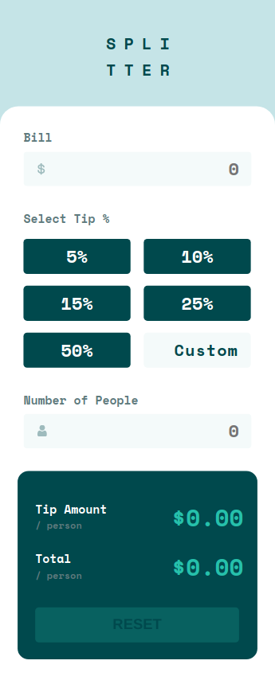
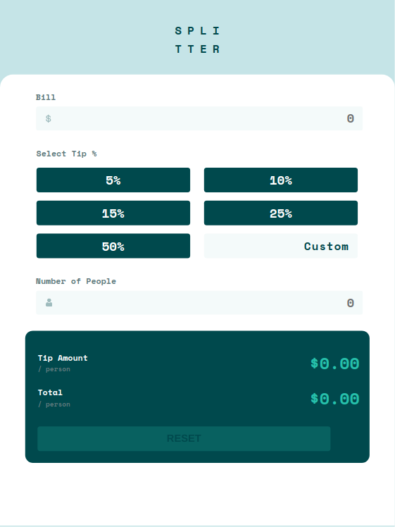
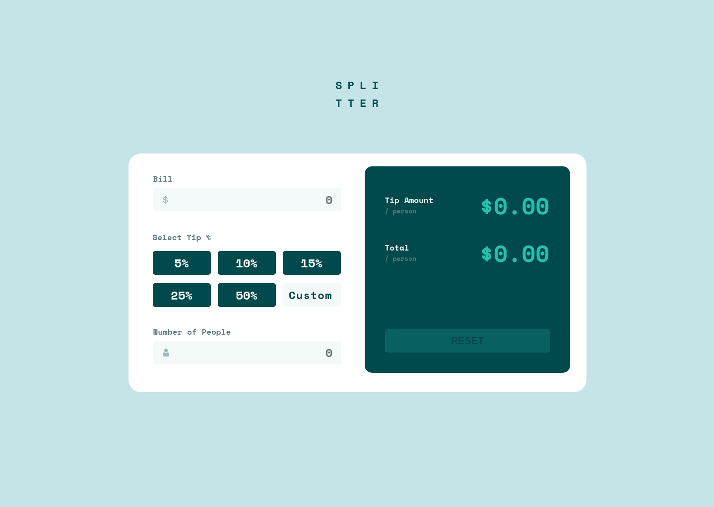
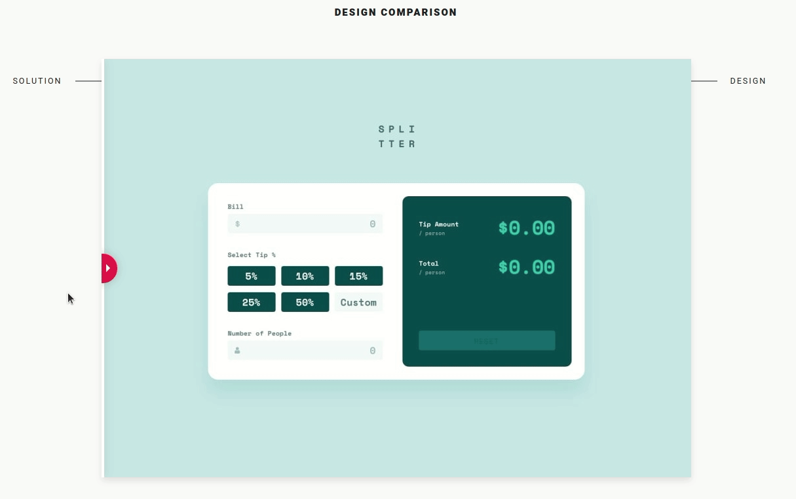

# Frontend Mentor - Tip calculator app solution

This is a solution to the [Tip calculator app challenge on Frontend Mentor](https://www.frontendmentor.io/challenges/tip-calculator-app-ugJNGbJUX). Frontend Mentor challenges help you improve your coding skills by building realistic projects.

## Table of contents

- [Overview](#overview)
  - [The challenge](#the-challenge)
  - [Screenshot](#screenshot)
  - [Links](#links)
- [My process](#my-process)
  - [Built with](#built-with)
  - [What I learned](#what-i-learned)
  - [Useful resources](#useful-resources)
- [Author](#author)

## Overview

This is the front-end mentor's sixteen challenge. The challenge is to build the "Tip calculator" and make it as close to the design as possible. Building the desing with whatever you want to finish, any language, framework or tools.

### The challenge

Users should be able to:

- View the optimal layout for the app depending on their device's screen size
- See hover states for all interactive elements on the page
- Calculate the correct tip and total cost of the bill per person

## Screenshot

### Mobile design

<p  align="center">
  </img>
</p>

### Tablets design

<p  align="center"></img></p>

### Desktop design

<p  align="center"></img></p>

### result of my work

<p  align="center"></img></p>

### Links

- Solution URL: [My solution for this challenge](https://www.frontendmentor.io/solutions/tip-calculator-with-reactjs-and-styledcomponenys-KSPgNB9yB)
- Live Site URL: [check the result](https://jcdmeira-tip-calculator.netlify.app)

- My figma design: [Figma](https://www.figma.com/file/DKN33fqAdPuGjT2RdbKzPj/16-tip-calculator)

## My process

### Built with

- Mobile-first workflow
- [React](https://reactjs.org/) - JS library

### What I learned

How to use the useContext hook

```JS
import React, { createContext, useContext, useState, useEffect } from 'react';
import P from 'prop-types';

// @ Um contexto com nome AppContext é criado, a partir do createContext
const TotalContext = createContext();

const TotalProvider = ({ children }) => {
  const [billValue, setBillValue] = useState(0);
  const [people, setPeople] = useState(0);
  const [error, setError] = useState(false);
  const [tipValue, setTipValue] = useState(0);
  const [tipAmount, setTipAmount] = useState(0);
  const [total, setTotal] = useState(0);
  const [reset, setReset] = useState(false);

  useEffect(() => {
    if (
      billValue !== 0 &&
      !isNaN(billValue) &&
      people !== 0 &&
      !isNaN(people)
    ) {
      setTipAmount(() => {
        let tipAmountCalc = (billValue / people) * (tipValue / 100);
        return parseFloat(tipAmountCalc).toFixed(2);
      });
      setTotal(() => {
        let totalAmount = billValue / people + parseFloat(tipAmount);
        return parseFloat(totalAmount).toFixed(2);
      });
    } else {
      setTotal('0.00');
      setTipAmount('0.00');
    }
  }, [billValue, people, tipValue, tipAmount]);

  useEffect(() => {
    if ((billValue > 0 && people === 0) || (billValue > 0 && isNaN(people))) {
      setError(true);
    } else {
      setError(false);
    }
  }, [billValue, people]);

  return (
    // @ Aqui se provém o contexto, passando os valores que esse contexto irá sustentar.
    // @ esses valores serão visivéis para todos os filhos do contexto (expresso em index.js)

    <TotalContext.Provider
      value={{
        billValue,
        setBillValue,
        people,
        setPeople,
        error,
        setError,
        tipValue,
        setTipValue,
        tipAmount,
        setTipAmount,
        total,
        setTotal,
        reset,
        setReset,
      }}
    >
      {children}
    </TotalContext.Provider>
  );
};

/*
  @ Cria o consumidor do contexto, para acessa o contexto teria que importar o
  @ useContext no lugar de uso, então usar algo como :
  ? const { valorPassado1, valorPassado2 } = useContext(contextoCriado);
  @ mas ao invés disso se o contexto com uma arrow function, podendo
  @ consumir diretamente ao usar a constante que recebe o valor.
  @ ficando com :
  ? const {valorPassado1, valorPassado2} = useGlobalContext();
*/

const TotalConsumer = () => useContext(TotalContext);

TotalProvider.propTypes = {
  children: P.object.isRequired,
};

export { TotalContext, TotalProvider, TotalConsumer };

```

```JSX
import React from 'react';

import { InputConteiner } from './style';
import dollar from '../../images/icon-dollar.svg';

import { TotalConsumer } from '../../Contexts/TotalContext';

function Bill() {
  const { billValue, setBillValue, setReset } = TotalConsumer();

  return (
    <InputConteiner image={dollar}>
      <label>Bill</label>
      <input
        type="number"
        className="input"
        placeholder="0"
        min="0"
        step="0.01"
        value={billValue === 0 ? '' : billValue}  // condicional para não ser possível colocar 0 no estado
        onChange={(event) => {
          setBillValue(Math.abs(parseFloat(event.target.value)) || 0);  // short circuit que não permite NaN indo para o state
          setReset(true);
        }}
      />
    </InputConteiner>
  );
}

export { Bill };
```

### Useful resources

- [react tutorial](https://pt-br.reactjs.org/tutorial/tutorial.html) - This helped me structure the components and build the proposed page.
- [my figma design](https://www.figma.com/file/DKN33fqAdPuGjT2RdbKzPj/16-tip-calculator) - My figma design for help anyone who wants to build this challenge.
- [CSS units conversor - px to VH/VW/REM](https://it-news.pw/pxtovh/) - CSS units conversor .
- [Converting Colors](https://convertingcolors.com) - HSL for all color systems.
- [input border remove](https://pt.stackoverflow.com/questions/5216/como-remover-borda-dos-input-e-textarea-de-todos-os-browsers-quando-clicado)
- [placeholder](https://www.devmedia.com.br/placeholder-em-html5-texto-padrao-de-input/24503)
- [css in placeholder](https://www.horadecodar.com.br/2019/07/16/como-adicionar-css-no-placeholder/)
- [placeholder how to style](https://www.devmedia.com.br/html5-placeholder-como-estilizar/24589)
- [outline](https://developer.mozilla.org/pt-BR/docs/Web/CSS/outline)
- [remove border css](https://www.ti-enxame.com/pt/css/como-remover-o-destaque-da-borda-em-um-elemento-de-texto-de-entrada/967095861/)
- [Prop Drilling](https://www.alura.com.br/artigos/prop-drilling-no-react-js)
- [context API](https://www.youtube.com/watch?v=c9BOd9X-SCM)
- [useContext - react hooks](https://www.youtube.com/watch?v=0UVYtx_C87w)

## Author

- Personal Page - [Jean Carlos De Meira](https://jcdmeira.github.io)
- Frontend Mentor - [@JCDMeira](https://www.frontendmentor.io/profile/JCDMeira)
- Instagram - [@jean.meira10](https://www.instagram.com/jean.meira10/)
- GitHub - [JCDMeira](https://github.com/JCDMeira)
